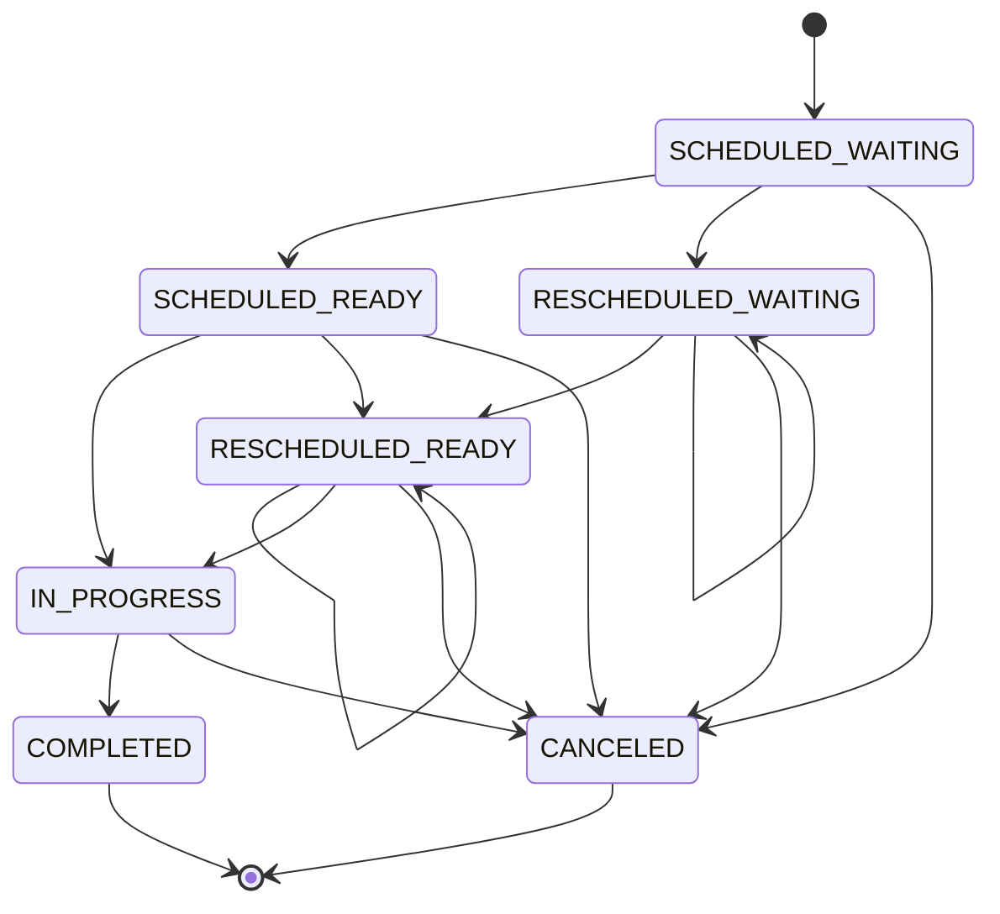

## User Story 19: Status management for appointments
**Title**: As an administrator, I want to change the status of an appointment.

**Acceptance Criteria**:
- The appointment status can be changed by the administrator.
- The appointment can have stauses:
  - SCHEDULED_READY: The appointment is scheduled and ready to be started.
  - SCHEDULED_WAITING: The appointment is scheduled, waiting for inventory.
  - RESCHEDULED_READY: The appointment is rescheduled and ready to be started.
  - RESCHEDULED_WAITING: The appointment is rescheduled, waiting for inventory.
  - IN_PROGRESS: The appointment is in progress.
  - COMPLETED: The appointment is completed.
  - CANCELED: The appointment is canceled.
- The appointment status transitions must fullfill the following state diagram:

**Definition of Done**:
- The service should correctly implement the status transitions for appointments.
- The `AppointmentStatusService` must allow valid transitions between appointment statuses according to the defined rules.
- The service must prevent invalid transitions, throwing an appropriate error when an invalid transition is attempted.

- The service should validate the status transition inputs:
  - The `currentStatus` and `newStatus` must be valid and recognized statuses within the system.
  - The service should only allow transitions between statuses that are explicitly defined as valid.
  - Invalid transitions must be rejected with a clear and specific error message.

- The service must return appropriate error messages for invalid status transitions:
  - Attempting to transition to an invalid status should throw an error with a message that clearly states the transition is not allowed.
- Ensure that error messages are consistent and informative, helping developers understand why a transition failed.

- Tests must cover all critical functionality, including:
  - Successful transitions between valid statuses.
  - Rejection of invalid status transitions.
  - Validation of all status transition rules.
- Test coverage should ensure that all possible valid and invalid transitions are tested.
